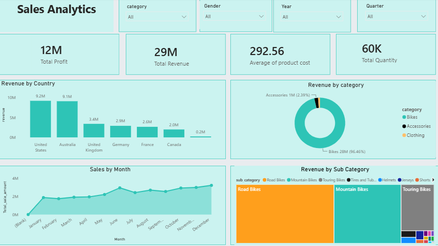

# 📊 Sales Data Warehouse & Business Intelligence Solution

## Dashboard Preview

## 📌 Project Overview

This project demonstrates the design and implementation of a complete Sales Data Warehouse and Business Intelligence solution using SQL Server and Power BI.

The solution follows the Medallion Architecture (Bronze, Silver, Gold) to transform raw sales data into a clean, analytical data model that supports interactive dashboards and business decision-making.

---

## 🎯 Business Problem

Organizations often store sales data in multiple raw files, making it difficult to analyze business performance and generate reliable insights.

This project builds a modern data warehouse to clean, transform, and organize sales data before visualizing it through Power BI dashboards.

---

## 🛠 Tech Stack

- SQL Server
- T-SQL
- ETL
- Medallion Architecture
- Star Schema
- Power BI
- DAX
- Power Query

---

## 🏗 Project Architecture

Raw Data
⬇
Bronze Layer
⬇
Silver Layer
⬇
Gold Layer
⬇
Star Schema
⬇
Power BI Dashboard

---

## 📊 Dashboard Features

- Sales Performance Analysis
- Revenue & Profit KPIs
- Customer Analysis
- Product Performance
- Time Intelligence
- Regional Analysis

---

## 📈 Key Business Insights

- Identified top-performing products based on revenue and profit.
- Analyzed monthly sales trends to support strategic planning.
- Evaluated regional sales performance across different markets.
- Measured customer purchasing behavior and contribution to revenue.
- Built KPIs to monitor business performance efficiently.

## 📂 Repository Structure

datasets/

docs/

power Bi/

scripts/

tests/

---
## 🎯 Skills Demonstrated

- Data Warehousing
- ETL Development
- SQL Query Optimization
- Star Schema Modeling
- Data Modeling
- Business Intelligence
- Dashboard Development
- Data Visualization

## 🚀 Author

**Moataz Sobhy Elkholy**

Junior Data Analyst | Business Intelligence Analyst
